# Plano incremental da modernização

Este plano leva a aplicação legada até a arquitetura alvo sem uma reescrita integral. Cada fase mantém a aplicação utilizável em `develop`, altera uma dimensão principal, produz evidências e identifica um ponto de rollback. A ordem é normativa; detalhes internos podem mudar quando não violarem os pré-requisitos e portões descritos aqui.

## Estratégia

- estabilizar a fundação antes de reorganizar o código;
- implementar módulos puros conforme suas dependências;
- conectar uma jornada real antes do primeiro Alpha;
- substituir a apresentação por destino, começando pelo Modo livre;
- manter uma única fonte de verdade durante cada corte;
- remover o caminho antigo e sua dependência depois da validação do substituto;
- publicar pré-versões somente quando seus portões objetivos forem satisfeitos.

```mermaid
flowchart LR
    p0["0. Histórico e fluxo"] --> p1["1. Baseline legada"]
    p1 --> p2["2. Vite e deploy"]
    p2 --> p3["3. Ferramentas modernas"]
    p3 --> p4["4. Braille puro"]
    p4 --> p5["5. Sessão + Modo livre legado<br/>alpha.1"]
    p5 --> p6["6. Preferências + Feedback<br/>alpha.2"]
    p6 --> p7["7. Renderer Braille"]
    p7 --> p8["8. Nova UI do Modo livre<br/>alpha.3"]
    p8 --> p9["9. Estrutura comum e páginas<br/>alpha.4"]
    p9 --> p10["10. Modo desafio<br/>alpha.5"]
    p10 --> p11["11. Remoção e estabilização<br/>beta.1"]
    p11 --> p12["12. Validação final<br/>rc.1"]
    p12 --> p13["13. Publicação<br/>v3.0.0"]
```

## Regras comuns a todas as fases

### Entrada

Uma fase começa somente quando os critérios da fase anterior estão registrados. Mudanças incompletas permanecem numa `feature/*`; `develop` recebe apenas incrementos concluídos e utilizáveis.

### Verificação

Toda fase executa, conforme os comandos já disponíveis naquele ponto:

- instalação reproduzível com `npm ci`;
- formatação e lint sem alteração silenciosa de arquivos;
- typecheck sem emissão;
- testes de módulos e contratos afetados;
- jornadas indicadas pelo impacto;
- build de produção;
- auditoria de dependências quando a árvore mudar;
- revisão da documentação e do `CHANGELOG.md`.

Exceções temporárias registram motivo, impacto, pessoa responsável e prazo. Uma fase não transfere exceções anônimas para a seguinte.

### Rollback

O rollback retorna ao último commit ou artifact verde conhecido. Feature flags só existem quando duas implementações precisam coexistir no mesmo build por um período real. Não se mantém duplicação permanente de estado para facilitar reversão.

## Fase 0 — Preservar histórico e ativar o fluxo

### Pré-requisitos

- decisões arquiteturais aprovadas;
- commit histórico `03f4365213c9aa00649f6fbe81904b890c84f211` identificado.

### Trabalho planejado

- marcar o commit histórico com `v2.0.0`, sem mover `v0.1` ou `v1.0`;
- preservar `the-original` sem novos commits;
- criar `develop` a partir do estado aprovado;
- proteger `main` e `develop` contra force-push e exclusão;
- exigir pull request e CI verde quando o workflow existir;
- registrar as jornadas essenciais da versão atual;
- guardar um commit e artifact recuperáveis da versão estável;
- inventariar dependências, consumidores e vulnerabilidades conhecidas.

### Conclusão

- branches, tags e regras correspondem à ADR de Git Flow;
- o ponto de partida e o rollback estão identificados;
- a árvore de dependências atual possui uma baseline registrada.

### Riscos e rollback

Configuração incorreta pode bloquear integração ou publicação. Validar permissões antes de exigir checks ainda inexistentes; reverter somente a regra incorreta, nunca mover tags históricas.

## Fase 1 — Tornar a aplicação legada reproduzível

### Pré-requisitos

- Fase 0 concluída.

### Trabalho planejado

- fixar Node.js 24 LTS;
- manter npm e `package-lock.json`;
- validar uma instalação limpa;
- estabilizar comandos de desenvolvimento, build e testes;
- criar testes provisórios somente para jornadas essenciais ainda não cobertas;
- criar CI inicial sobre a aplicação legada;
- registrar vulnerabilidades herdadas como baseline, impedindo regressões críticas ou altas em produção.

### Conclusão

- um ambiente limpo instala, testa e produz o build atual;
- a CI executa os mesmos comandos disponíveis localmente;
- falhas conhecidas estão separadas de regressões novas.

### Dependências, riscos e rollback

Não modernizar `react-scripts`, Jest ou bibliotecas descartáveis por si mesmas. Se Node.js 24 expuser incompatibilidade bloqueadora, isolar o mínimo necessário e registrar a exceção; o rollback usa o ambiente anterior somente até o corte seguinte ficar viável.

## Fase 2 — Substituir CRA por Vite e automatizar o deploy

### Pré-requisitos

- baseline reproduzível e jornadas essenciais registradas.

### Trabalho planejado

1. produzir um build Vite equivalente sem atualizar React nem redesenhar a interface;
2. migrar HTML, ponto de entrada, assets e configuração de base;
3. adotar roteamento por hash e um `404.html` estático e acessível;
4. validar desenvolvimento e artifact;
5. automatizar CI e deploy no GitHub Pages;
6. validar rotas, assets, jornadas e republicação de um artifact conhecido;
7. remover `react-scripts`, `gh-pages`, scripts e configuração antigos;
8. auditar a nova árvore.

### Conclusão

- Vite é o único build ativo;
- `dist/` é publicado por GitHub Actions;
- o commit publicado, o artifact e o deploy são rastreáveis;
- CRA permanece recuperável somente pelo commit anterior, não no código ativo.

### Riscos e rollback

Os riscos principais são base incorreta, rotas quebradas e assets ausentes. CRA e Vite podem coexistir apenas durante a comparação curta; antes da remoção, o rollback republica o artifact CRA. Depois do corte, reverte-se a mudança completa ou republica-se o último artifact estável.

## Fase 3 — Modernizar a fundação de desenvolvimento

### Pré-requisitos

- build e deploy Vite estáveis.

### Trabalho planejado

Cada item é uma mudança isolada e reversível:

1. migrar Jest para Vitest;
2. estabelecer formatação, lint e typecheck sem emissão;
3. atualizar React de 18.2 para 18.3 e corrigir avisos;
4. atualizar React de 18.3 para 19.2;
5. adotar TypeScript 6 com `strict`;
6. criar regras contra imports internos e ciclos entre capacidades;
7. remover dependências e configurações sem uso;
8. executar instalação limpa, jornadas, build e auditoria completa.

### Conclusão

- novos módulos podem nascer em TypeScript estrito;
- a interface operacional do projeto possui comandos estáveis;
- CI aplica os guardrails comuns;
- nenhuma ferramenta legada permanece ativa.

### Riscos e rollback

Atualizações simultâneas esconderiam a origem de regressões. Cada passo possui commit ou pull request próprio; o rollback reverte somente essa dimensão e restaura seu lockfile.

## Fase 4 — Implementar a capacidade `braille`

### Pré-requisitos

- TypeScript 6 estrito e guardrails ativos;
- ADRs do Motor, Documento Braille e Grafia Braille aprovadas.

### Trabalho planejado

1. valores fundamentais: Ponto Braille, Cela Braille e Impressão de cela;
2. `braille/machine`: Intenções, Acorde Braille e Operações da máquina;
3. `braille/document`: Grade Braille, Configuração de papel, Documento Braille e posições;
4. `braille/orthography`: Perfil de grafia e Interpretação Braille;
5. interface deliberada em `braille/public.ts`;
6. testes de cada módulo pela própria interface.

### Conclusão

- regras puras não dependem de React, DOM, áudio ou `Immutable.js`;
- Impressão de cela vazia, posição nunca utilizada e pontos apagados permanecem distintos;
- erros e trechos não reconhecidos são observáveis, não escolhas silenciosas.

### Riscos e rollback

O maior risco é copiar os modelos rasos legados para novas pastas. O módulo ainda não conectado é inerte e pode ser removido sem alterar a jornada publicada; testes devem expressar ADRs e domínio, não caracterizar defeitos antigos.

## Fase 5 — Implementar a Sessão de digitação e integrar o Modo livre

### Pré-requisitos

- capacidade `braille` concluída.

### Trabalho planejado

- criar estado e transição puros da Sessão de digitação;
- coordenar posições, captura, políticas e Configuração efetiva da sessão;
- criar o adapter web de teclado físico;
- integrar a apresentação legada do Modo livre por um adapter de compatibilidade curto;
- transferir a fonte de verdade para a Sessão de digitação;
- validar digitação, espaço, controles essenciais e Interrupção da captura.

### Conclusão e versão

Publicar `v3.0.0-alpha.1` quando uma jornada real do Modo livre usar Motor, Documento Braille e Sessão de digitação novos, com CI, build, testes e rollback verdes.

### Riscos e rollback

Não manter listas legadas concorrentes com o Documento Braille. Antes da remoção do caminho anterior, o corte pode ser revertido integralmente; depois dele, o rollback é a reversão do commit de integração, não sincronização dupla.

## Fase 6 — Implementar Preferências e Feedback multimodal

### Pré-requisitos

- primeiro Alpha validado.

### Trabalho planejado

- criar `preferences` e seu adapter web;
- criar o planejador puro de Feedback multimodal;
- criar catálogo localizável e adapters de som, fala e mensagens acessíveis;
- conectar os fatos semânticos pela composition root;
- garantir que falhas de um adapter não alterem o domínio;
- substituir `AudioProvider` e remover `use-sound` depois do último consumidor.

### Conclusão e versão

Publicar `v3.0.0-alpha.2` quando preferências explícitas e feedback substituível cobrirem a jornada do Modo livre, inclusive falhas e silêncio.

### Riscos e rollback

Duplicar áudio pode falar ou tocar o mesmo fato duas vezes. Cortar cada classe de saída uma vez, com teste de contrato; reverter o corte mantém os módulos puros, mas restaura temporariamente o executor anterior.

## Fase 7 — Decidir e preparar o renderer visual Braille

### Pré-requisitos

- Documento Braille e sua semântica disponíveis;
- investigação das medidas normativas e das limitações de tamanho físico em telas concluída.

### Trabalho planejado

- prototipar um renderer que receba Impressões de cela, não caracteres textuais;
- representar pontos elevados, pontos inativos, espaço explícito, posição nunca utilizada e vestígios quando aplicável;
- preservar proporções normativas numa geometria-base;
- avaliar escala, contraste, cores, numeração e modos visuais;
- documentar limites de milímetros físicos em telas sem calibração;
- escolher uma interface independente de fonte e do contexto de uso.

### Conclusão

- protótipo aprovado com critérios de acessibilidade e personalização;
- interface do renderer pronta para uso em grade, revisão, exemplos e materiais didáticos;
- destino e licença das fontes legadas registrados.

### Riscos e rollback

Não remover as fontes antes da validação do renderer. Se a nova representação falhar, a apresentação legada continua disponível até o corte da fase seguinte.

## Fase 8 — Substituir a apresentação do Modo livre

### Pré-requisitos

- renderer visual aprovado;
- Sessão de digitação, Preferências e Feedback multimodal estáveis.

### Trabalho planejado

- criar a apresentação compartilhada de `ui/session`;
- integrar o renderer de Impressões de cela;
- criar a nova página do Modo livre;
- preservar foco, semântica, revisão, captura e visualizações exigidas;
- remover o adapter de compatibilidade e a apresentação legada desse destino;
- remover fontes Braille somente quando nenhum consumidor permanecer.

### Conclusão e versão

Publicar `v3.0.0-alpha.3` quando o Modo livre usar somente a nova apresentação e suas jornadas acessíveis estiverem verdes.

### Riscos e rollback

O corte é por rota. Restaurar a página anterior não desfaz módulos puros já validados; a nova e a antiga página não escrevem simultaneamente no mesmo estado.

## Fase 9 — Substituir a estrutura comum e os destinos auxiliares

### Pré-requisitos

- nova apresentação do Modo livre validada.

### Trabalho planejado

- criar navegação, foco inicial, retorno e recuperação de falhas em `app`;
- migrar preferências, início, ajuda ou sobre e destino não encontrado;
- estabelecer CSS Modules, tokens e base global mínima;
- remover Bootstrap e Bootswatch por destino, sem alterar a identidade visual sem decisão própria;
- revisar Font Awesome pelo uso real e pela acessibilidade.

### Conclusão e versão

Publicar `v3.0.0-alpha.4` quando a estrutura comum e os destinos auxiliares não dependerem da composição legada.

### Riscos e rollback

Mudanças globais de CSS podem afetar rotas já migradas. Isolar estilos por destino e reverter a rota ou folha afetada; Bootstrap só sai depois do último consumidor.

## Fase 10 — Substituir o Modo desafio

### Pré-requisitos

- apresentação compartilhada da Sessão de digitação estabilizada;
- estrutura comum e feedback ativos.

### Trabalho planejado

- implementar regras puras de proposta, resposta, avaliação, correção, desistência e reinício;
- usar Sequência Braille como resposta e Interpretação Braille para explicação;
- criar a nova apresentação do Modo desafio;
- preservar acessibilidade sem revelar a resposta pedagógica indevidamente;
- remover estado, listas e imports de `Immutable.js` legados.

### Conclusão e versão

Publicar `v3.0.0-alpha.5` quando as jornadas do Modo desafio estiverem completas sobre a arquitetura nova.

### Riscos e rollback

O risco principal é confundir texto interpretado com a resposta Braille. Testar pela Sequência Braille; o corte e o rollback continuam por rota.

## Fase 11 — Remover o legado e entrar em Beta

### Pré-requisitos

- todos os destinos previstos funcionam na arquitetura alvo.

### Trabalho planejado

- remover implementações, testes provisórios, estilos, assets e configuração sem consumidores;
- remover `Immutable.js`, Bootstrap, Bootswatch, fontes Braille e Font Awesome somente quando não houver uso real;
- executar análise de imports, ciclos e dependências;
- completar READMEs das capacidades e o changelog;
- abrir `release/v3.0.0`;
- publicar preview identificado em `/next/`, com namespace separado de dados.

### Portão `v3.0.0-beta.1`

- capacidades previstas estão funcionalmente completas;
- nenhuma implementação legada mantém estado autoritativo;
- jornadas essenciais estão completas;
- pendências de remoção são explícitas;
- novas capacidades deixam de entrar na versão 3.

### Riscos e rollback

Remoções em massa escondem consumidores. Fazer cortes por dependência e usar análise automática; uma Beta defeituosa volta à Alpha conhecida enquanto a raiz estável permanece intacta.

## Fase 12 — Validar a Release Candidate

### Pré-requisitos

- Beta estabilizada e sem capacidade planejada ausente.

### Portão `v3.0.0-rc.1`

- código e dependências legados previstos foram removidos;
- instalação, formatação, lint, typecheck, testes e build passam;
- não existe vulnerabilidade crítica ou alta de produção sem exceção formal;
- jornadas automatizadas e procedimentos manuais passam;
- matriz de navegadores e tecnologias assistivas foi executada;
- não existe barreira conhecida de WCAG 2.2 A ou AA;
- documentação, changelog e rollback estão completos;
- nenhuma mudança incompatível adicional está planejada.

Somente correções bloqueadoras entram durante RC e retornam também para `develop`. Cada nova correção produz nova RC e repete as verificações afetadas.

### Riscos e rollback

Uma RC reprovada não é corrigida no deploy. Publicar nova RC a partir da correção rastreável; `/next/` pode voltar à pré-versão anterior.

## Fase 13 — Publicar `v3.0.0`

### Pré-requisitos

- uma RC completou a validação sem bloqueadores.

### Trabalho planejado

- integrar `release/v3.0.0` em `main` sem squash;
- retornar correções para `develop`;
- atualizar `CHANGELOG.md` com data e links;
- criar a tag `v3.0.0` e a GitHub Release no commit publicado;
- publicar o mesmo commit na raiz do GitHub Pages;
- verificar produção e evidências ligadas à release;
- encerrar ou preparar `/next/` para a próxima linha.

### Conclusão

- `main`, tag, GitHub Release e deploy identificam o estado aprovado;
- a versão anterior continua recuperável;
- árvore final e dependências foram auditadas;
- documentação corresponde ao produto publicado;
- não existe exceção temporária sem pessoa responsável e prazo.

### Rollback

Republicar o commit estável anterior e abrir `hotfix/*`. Tags e releases não são apagadas nem movidas; a falha e a correção permanecem históricas e rastreáveis.

## Política de pré-lançamentos

| Estágio | Origem | Distribuição | Significado |
|---|---|---|---|
| Alpha | commits verdes de `develop` | GitHub Prerelease e artifact de CI | arquitetura incompleta; interfaces podem mudar |
| Beta | `release/v3.0.0` | Prerelease, artifact e `/next/` | capacidades completas; estabilização e remoção final |
| RC | `release/v3.0.0` | Prerelease, artifact e `/next/` | candidata exata; somente correções bloqueadoras |
| Final | `main` | GitHub Release e raiz do Pages | versão aprovada e estável |

O preview informa visual e semanticamente que não é a versão estável. Preferências e dados usam namespace separado, para que testes não alterem o estado da aplicação publicada.

## Política de dependências

Cada dependência é classificada como remover, substituir, manter temporariamente ou atualizar. A remoção ocorre depois do último consumidor validado:

| Dependência | Momento planejado |
|---|---|
| `react-scripts`, `gh-pages` | depois do corte validado para Vite e GitHub Actions |
| Jest e tipos relacionados | depois da suíte migrar para Vitest |
| `use-sound` | depois dos adapters de Feedback multimodal |
| `immutable` | depois de sessão, documento e desafio deixarem de usá-lo |
| Bootstrap e Bootswatch | por destino; remoção após a última página legada |
| fontes Braille | depois da aprovação e integração do renderer visual |
| Font Awesome | durante a nova UI, conforme uso real e acessibilidade |
| `web-vitals` | durante o corte Vite, conforme exista consumidor e objetivo definidos |

Não se investe na remediação isolada de uma dependência descartável. Nenhuma mudança pode introduzir vulnerabilidade crítica ou alta de produção equivalente sem exceção formal.

## Jornadas preservadas durante a migração

- entrar no Modo livre;
- produzir Braille por acordes com teclado físico;
- inserir espaço e usar controles essenciais da máquina;
- alternar visualização em Braille ou tinta;
- receber o feedback necessário por meios disponíveis;
- entrar no Modo desafio, receber uma proposta e verificar a resposta;
- navegar pelos destinos mantidos.

Defeitos conhecidos, semântica inacessível e comportamentos contrários às ADRs não são congelados. Diferenças intencionais são documentadas e testadas.

## Matriz de rollback

| Mudança | Retorno seguro |
|---|---|
| ferramenta ou dependência | reverter a mudança isolada e restaurar o lockfile |
| CRA para Vite | republicar o artifact CRA enquanto o corte ainda está em validação |
| módulo puro ainda não integrado | remover ou reverter sem afetar jornadas |
| capacidade conectada ao legado | reverter o corte e restaurar o adapter anterior |
| página migrada | restaurar a rota anterior sem desfazer módulos puros |
| Alpha, Beta ou RC | republicar a pré-versão anterior conhecida |
| versão final | republicar o commit estável anterior e abrir hotfix |
