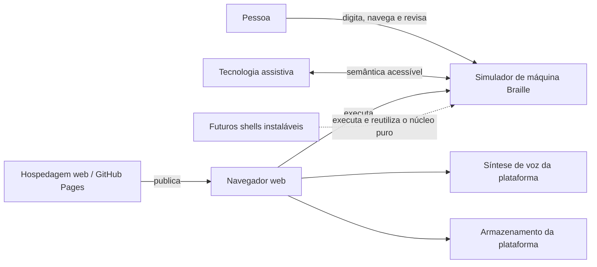
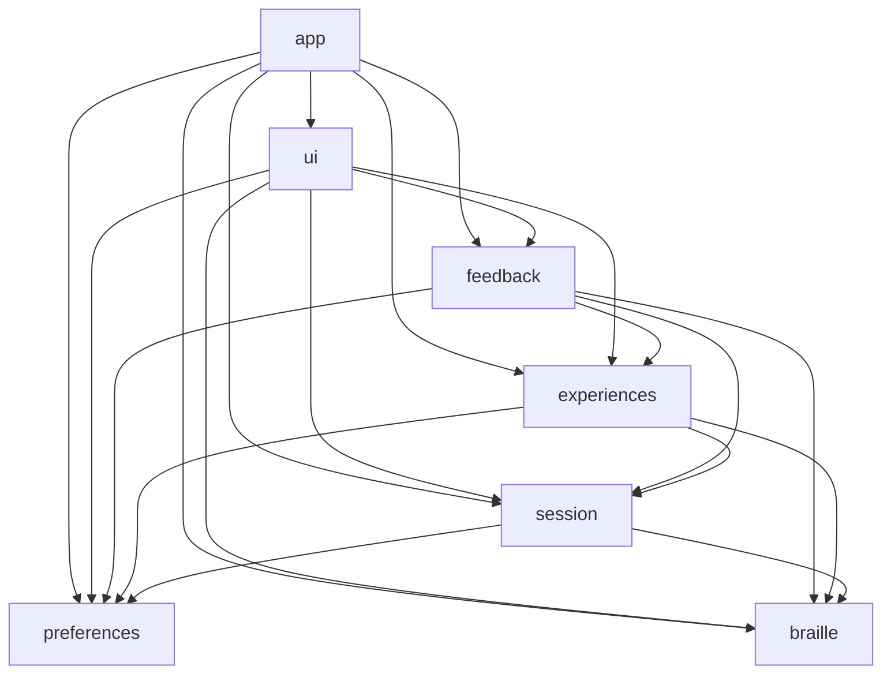

# Visão geral

O Simulador de máquina Braille é um produto educacional que atende pessoas videntes, pessoas cegas e pessoas com baixa visão. A arquitetura separa as regras estáveis do produto das tecnologias usadas para apresentá-las e executá-las. Assim, React, navegador, áudio, armazenamento e futuras plataformas podem mudar sem reimplementar Motor, Documento Braille, Sessão de digitação ou Experiências do simulador.

## Princípios

1. Organizar primeiro por capacidades do produto.
2. Projetar módulos profundos: interfaces pequenas escondem regras complexas.
3. Manter estado e transições do domínio em TypeScript puro.
4. Executar efeitos somente por adapters substituíveis.
5. Tratar acessibilidade como contrato distribuído, não como correção posterior.
6. Fazer páginas finas e concentrar a composição em `app`.
7. Testar módulos pela mesma interface usada pelos consumidores.
8. Preservar o Documento Braille como fonte de verdade; texto, voz e apresentação visual são projeções.

## Contexto do sistema

Escopo do diagrama: pessoas, plataformas e dependências externas duráveis. Atualizado em 2026-09-04. Decisões relacionadas: [ADRs 0005, 0006, 0008 e 0011](../adr/).

## Visão dos módulos

Escopo do diagrama: capacidades de primeiro nível e sentido permitido das dependências. Atualizado em 2026-09-04. Detalhes e regras: [Módulos e dependências](modules.md).

Uma seta significa “pode conhecer a interface pública de”. Ela não obriga a dependência. Dependências no sentido contrário e ciclos são proibidos.

## Acessibilidade

A acessibilidade atravessa todas as capacidades. Cada módulo preserva as invariantes sob seu controle:

- os módulos puros produzem estado e fatos semânticos estruturados;
- `ui` oferece estrutura, foco, operabilidade e apresentação acessíveis;
- `feedback` preserva o significado entre texto, mensagens acessíveis, Leitura falada do aplicativo e sons;
- os adapters não tornam um meio específico obrigatório;
- jornadas completas verificam o resultado com diferentes modalidades.

Não existe um módulo central de “acessibilidade” que corrija resultados inacessíveis produzidos por outras capacidades.
