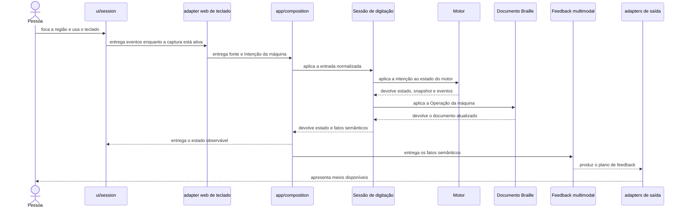
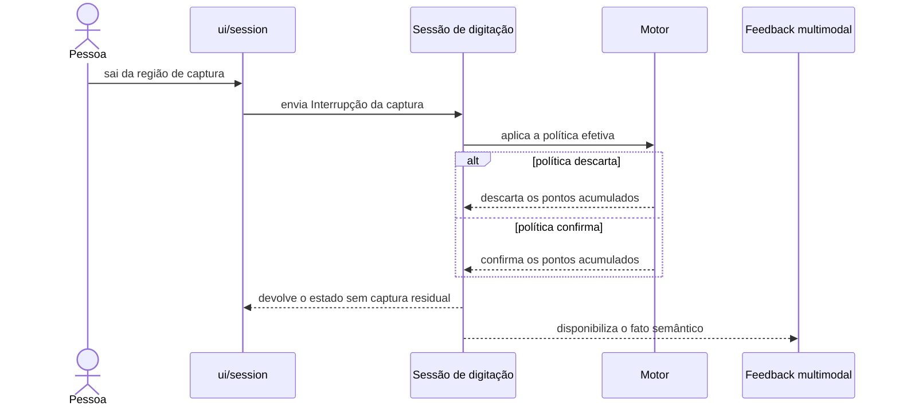
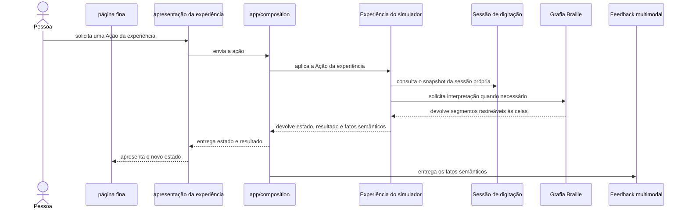
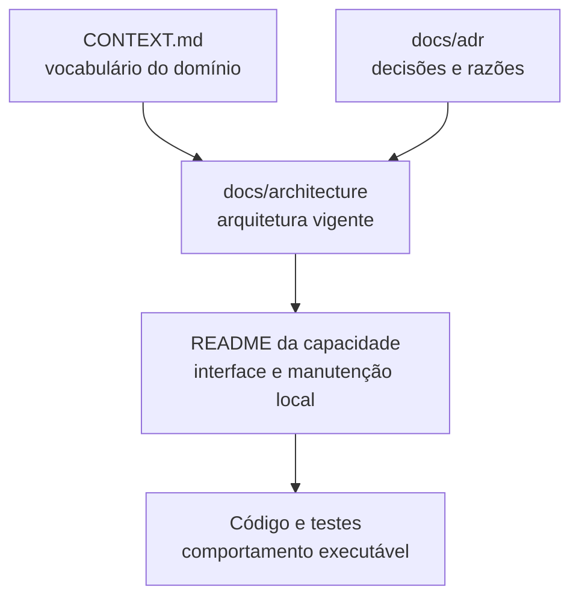

# Fluxos em execução

Os diagramas mostram relações duráveis. Eles omitem nomes de funções e detalhes internos para continuarem úteis durante refatorações.

## Digitação e feedback

Escopo: da entrada por teclado físico à atualização do Documento Braille e ao Feedback multimodal. Atualizado em 2026-09-04. Interfaces relacionadas: `session`, `braille` e `feedback`.

A composition root conecta fatos semânticos ao Feedback multimodal. O diagrama não implica que a Sessão de digitação execute efeitos ou conheça adapters de saída.

## Interrupção da captura

Escopo: perda de foco, pausa ou ocultação da página durante um Acorde Braille. Atualizado em 2026-09-04. Decisões relacionadas: ADRs 0001, 0003 e 0006.

## Experiência do simulador

Escopo: uma ação numa experiência guiada que usa sua própria Sessão de digitação. Atualizado em 2026-09-04. Interfaces relacionadas: `experiences`, `session`, `braille`, `ui` e `feedback`.

A experiência controla seu ciclo de vida e seus Requisitos da experiência. Ela não altera as Preferências do simulador e não executa áudio, foco ou persistência diretamente.

## Sistema de documentação

Escopo: localização da informação arquitetural. Atualizado em 2026-09-04. Decisão relacionada: ADR 0011.

