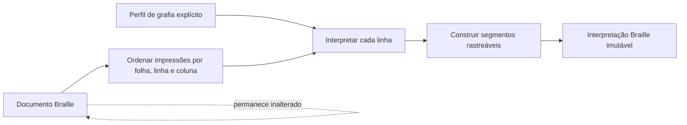
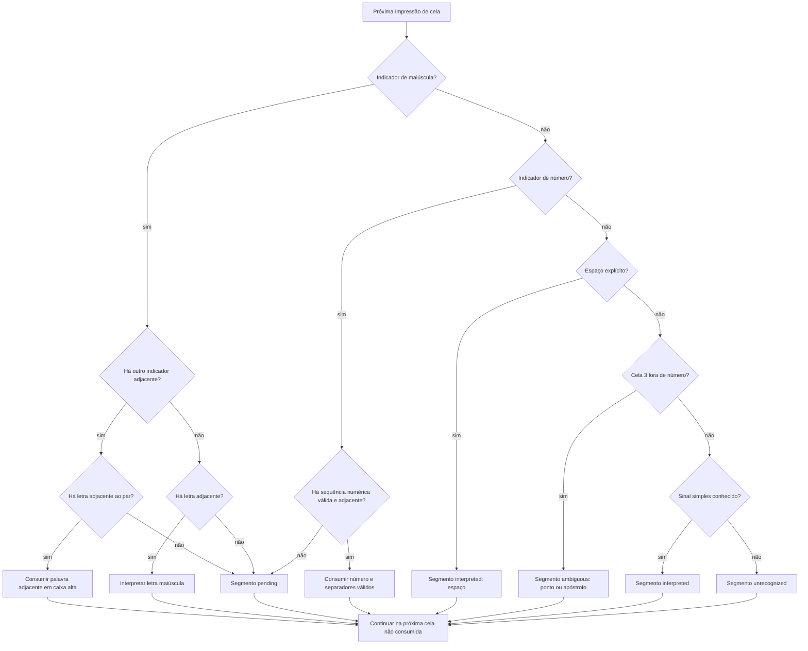

# Algoritmo de interpretação Braille

Este documento explica como `interpretBrailleDocument` deriva uma
`BrailleInterpretation` (Interpretação Braille) sem modificar nem substituir o
`BrailleDocument` (Documento Braille). A referência do perfil atualmente
implementado está em
[`docs/braille/portuguese-braille-2018.md`](../../../docs/braille/portuguese-braille-2018.md).

## Contrato

A entrada é um Documento Braille e um `OrthographyProfile` (Perfil de grafia)
criado explicitamente por `createOrthographyProfile`. A saída é uma projeção
imutável, dividida em linhas e Segmentos de interpretação.

O documento continua sendo a fonte de verdade. A interpretação não grava texto
nas Impressões de cela, não altera posições e não remove vestígios de Apagamento
físico. Reinterpretar o mesmo documento com o mesmo perfil produz o mesmo
resultado.



## Etapas

### 1. Formar as sequências de cada linha

O algoritmo percorre as Folhas Braille na ordem, agrupa as Impressões de cela
por linha e ordena cada grupo pela coluna. Uma posição nunca utilizada não vira
uma cela vazia: ela continua ausente e interrompe qualquer sinal que exija
adjacência. Uma Impressão de cela sem pontos, por outro lado, é um espaço
explícito e produz um segmento com `text: " "`.

### 2. Reconhecer sinais contextuais

Cada linha é analisada da esquerda para a direita. Antes da consulta aos sinais
simples, o algoritmo procura indicadores conhecidos. Isso é importante porque a
mesma Cela Braille pode mudar de significado conforme a sequência.



Os reconhecedores consomem somente celas adjacentes na mesma folha e linha. Por
exemplo, o indicador de maiúscula na coluna 0 e a letra `a` na coluna 2 não
formam `A` quando a coluna 1 nunca foi utilizada. O resultado contém um
indicador `pending` e um `a` independente.

### 3. Produzir segmentos e diagnósticos

Há quatro estados observáveis:

| Estado         | Significado                                                                    |
| -------------- | ------------------------------------------------------------------------------ |
| `interpreted`  | O perfil reconheceu o sinal e, quando aplicável, produziu `text` ou `meaning`. |
| `pending`      | Um indicador conhecido ainda não possui a sequência necessária.                |
| `ambiguous`    | O perfil conhece mais de uma leitura possível e não escolhe silenciosamente.   |
| `unrecognized` | O perfil atual ainda não reconhece a cela ou sequência.                        |

Indicadores reconhecidos permanecem como segmentos com `role: "indicator"`,
mesmo sem texto próprio. O símbolo afetado forma outro segmento com
`role: "symbol"`.

### 4. Manter a rastreabilidade

Todo segmento possui `source`, uma lista de `DocumentPosition` com folha, linha
e coluna. Um símbolo contextual inclui tanto suas próprias celas quanto os
indicadores que determinaram o significado. Por isso as origens podem se
sobrepor entre segmentos.

Exemplo para o número `12`, produzido pelas celas `(3456) (1) (12)`:

```text
indicator number  source: [coluna 0]
symbol "12"       source: [colunas 0, 1, 2]
```

Essa sobreposição permite explicar tanto a função isolada do indicador quanto a
origem completa do texto resultante.

## Pureza e extensão

As tabelas, a ordem de precedência e o estado transitório do reconhecimento são
detalhes internos de `orthography.ts`. Consumidores selecionam um perfil
conhecido e recebem segmentos; não injetam regras nem controlam o estado do
parser.

Ao ampliar um perfil:

1. acrescente primeiro um exemplo normativo em `orthography.test.ts` pela
   interface `braille/public.ts`;
2. mantenha sinais compostos antes de sinais simples que compartilhem celas;
3. exija adjacência quando a grafia definir uma sequência contínua;
4. preserve `pending`, `ambiguous` ou `unrecognized` quando não houver base para
   uma escolha única;
5. atualize a referência específica do perfil e execute `npm run ci`.
